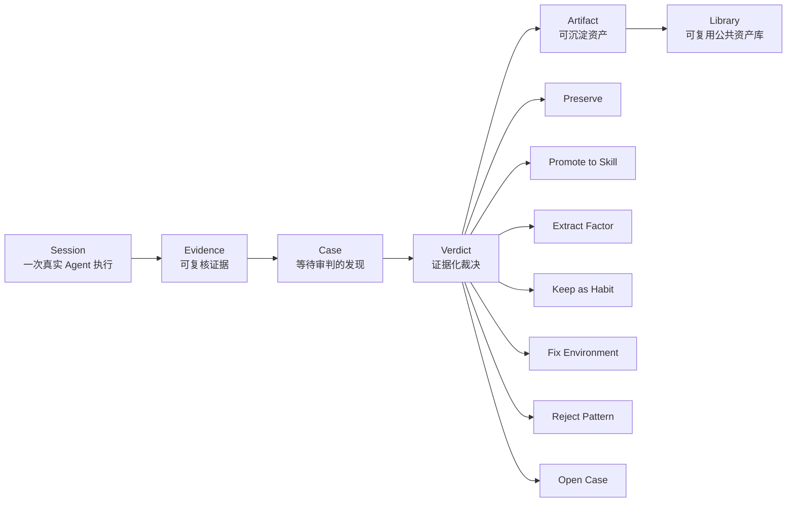
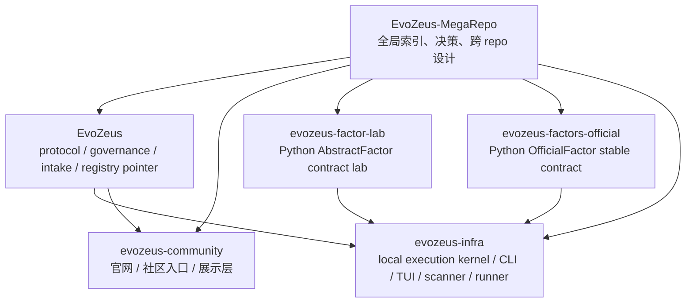

# EvoZeus 整体设计

- Status: active
- Last updated: 2026-06-19
- Scope: EvoZeus 全局产品、repo 拓扑、贡献治理、Factor contract、未来 runtime
- Owner: MetaInFlow

本文是 EvoZeus mega repo 的全局设计入口。它不替代 `10-repos/evozeus` 中的协议、schema、技能和治理细节，而是说明多个 repo 如何协同承载 EvoZeus。

Repo 命名、目录结构和 future runtime / skill / factor 文件组织，见 `repo-structure-naming.md`。

## 1. One-line Definition

EvoZeus 是 Agent Session Judgment Layer：把真实 Agent Session 放上审判台，什么该沉淀，什么该修正，什么该淘汰，由证据决定。

```text
Session -> Evidence -> Case -> Verdict -> Artifact -> Library
```

## 2. Product Boundary

EvoZeus 当前首先是 agent-readable protocol repo，不是稳定 CLI 产品。主 repo 采用 **Protocol-only** 职责边界：它拥有判断协议、治理流程、公共入口和 registry pointer，不拥有 runtime 执行层。

默认承诺：

- zero-install entry：Agent 读 `SKILL.md` 即可开始。
- local-first：raw session 默认留在本地。
- evidence-backed：没有 Evidence 不形成 Verdict。
- user-approved contribution：创建 issue、PR、上传外部平台前必须得到用户确认。
- opt-in runtime：scanner、Factor execution、MCP、LLM、可视化等运行能力必须显式启用。

主 repo 不拥有：

- scanner implementation。
- runtime CLI / TUI / companion / local API。
- installable Factor pack 或 scanner pack。
- `.evozeus/` local state、lockfile、SQLite ledger、report execution。
- runtime upload、联网、插件执行或 sandbox 实现。

旧执行层遗留结构已从 `10-repos/evozeus` 主 repo 清理。runtime 设计材料已移至 `10-repos/evozeus-infra/docs/`，scanner / runner prototype 已移至 `10-repos/evozeus-infra/prototypes/main-repo-runtime/`；任何新的 CLI、TUI、scanner、Factor execution、local state 或 report implementation 都应在 `evozeus-infra` 中按权限模型重建。

## 3. Core Loop



核心对象：

| Object | 含义 | 默认边界 |
| --- | --- | --- |
| Session | 一次真实 Agent 执行 | 原始材料默认本地保存 |
| Evidence | 支撑判断的最小证据 | 必须可追溯、可脱敏 |
| Case | 等待审判的 session-derived finding | 不是任意观点 |
| Verdict | 对 Case 或 Candidate 的裁决 | 必须绑定证据和下一步动作 |
| Artifact | Verdict 落成的资产 | Skill、Factor、Habit、Environment Rule、Accepted Case、Rejected Pattern |
| Library | 被接受的可复用公共资产库 | 需要索引、生命周期、淘汰路径 |

## 4. Global Repo Topology



Repo 职责：

| Repo | 职责 | 当前状态 |
| --- | --- | --- |
| `EvoZeus-MegaRepo` | 全局工作区、跨 repo 决策、资料索引、repo 拓扑 | active / remote 已创建 |
| `EvoZeus` | Protocol-only 主 repo：`SKILL.md`、docs、schemas、governance gates、Case/Candidate intake、semantic artifact、registry pointer | active；执行层遗留已清理 |
| `evozeus-community` | private Web 源码、官网部署面、社区解释层、`/skill` 入口 | active / 已接入 |
| `evozeus-factor-lab` | Python `AbstractFactor` 草案、Factor spec 草案、examples、contract tests | active / 已接入 |
| `evozeus-factors-official` | 稳定 Python `OfficialFactor`、官方 spec schema、canonical examples | active / 已接入 |
| `evozeus-infra` | local execution kernel：workspace、scanner sandbox、Python factor runner、SQLite ledger、report、CLI/TUI/companion | active shell / 产品能力仍需实现 |

## 5. 用户旅程

```text
Community /skill
  -> copy registration / install guide
  -> Agent reads EvoZeus-Install Registration
  -> Agent checks existing .evozeus state
  -> EvoZeus skeleton and skills installed
  -> user approves protocol judgment
  -> Agent reads EvoZeus SKILL.md and Start Here
  -> user approves runtime path
  -> runtime scans / analyzes only after approval
  -> local judgment run
  -> judgment / Session Verdict Card
  -> user approves preservation
  -> contribution or development route
```

关键原则：

- `/skill` 默认只指导注册、检查 `.evozeus`、安装 skeleton 和 skills，不直接执行 judgment。
- Start Here 默认只激活 protocol skeleton，不静默安装 runtime 或 factors。
- runtime 是可选本地执行平面，必须说明读取范围、写入范围、网络行为和回滚方式。
- Factor 默认语言是 Python；runtime 运行实现 Python Factor contract 的 selected factors。
- `factor-lab` 和 `factors-official` 的 examples 不能被当成默认业务 Factor 安装源。

## 6. 贡献和沉淀路由

| 沉淀对象 | 路由 |
| --- | --- |
| Case / Evidence / judgment report | `EvoZeus` issue 或 Candidate PR |
| semantic Factor proposal | `EvoZeus` 主 repo |
| Python Factor contract 草案 / example | `evozeus-factor-lab` |
| 稳定 OfficialFactor contract / canonical example | `evozeus-factors-official` |
| scanner / resolver / local execution / SQLite / report generation | `evozeus-infra` |
| 真实业务 Factor pack 发布物 | 当前不放入 `factor-lab` 或 `factors-official`；后续需单独定义发布机制 |

社区共创不是先给社区 repo write 权限，而是把真实 session 观察逐层变成可审查资产：

- Discord 是 PR 前缓冲层，不替代 GitHub governance。
- `EvoZeus` public 主 repo 是正式社区入口和 canonical governance surface。
- 普通 Case、Candidate、Pattern、docs/example 贡献不进入 `evozeus-factor-lab`。
- raw private session、客户资料、secret、内部路径、未脱敏日志不进入任何 public repo。

## 7. Factor Contract Design

Factor 不是先做 pack 仓库。当前阶段先稳定 Python contract。

| Layer | Repo / 路径 | 职责 | 不做什么 |
| --- | --- | --- | --- |
| Semantic Factor | `EvoZeus` issue / Candidate PR | 接收 Factor Candidate、evidence、counterexample、review target | 不接收 raw session、scanner code、未审 pack |
| Draft contract | `evozeus-factor-lab` | Python `AbstractFactor`、draft spec、examples、tests | 不做 submissions/reviewed/rejected，不存真实业务 pack |
| Stable contract | `evozeus-factors-official` | Python `OfficialFactor`、official spec schema、canonical examples | 不做 manifest/checksum/SBOM/attestation，不存 release pack |
| Runtime execution | `evozeus-infra` | 按 Python contract 运行 selected factors，写 ledger/report | 不定义公共协议语义 |

FactorResult 的基本原则：

- `matched` 必须有 `evidence_refs`。
- evidence ref 指向 normalized session event，不直接嵌入 raw private session。
- Factor 输出 tags、verdict signals 和 confidence，但不直接替代 Verdict。
- 失败要隔离，不应中断其它 Factor。

## 8. Runtime Trust Design

runtime 是本地执行内核，目标闭环：

```text
onboard -> scan -> analyze -> report -> doctor
```

runtime 拥有：

- workspace bootstrap、`.evozeus/infra`、config、lockfile。
- SQLite Local Analysis Ledger。
- scanner sandbox、resolver runtime、permission gate。
- Python factor runner、`subprocess_uv` isolation、timeout、error isolation。
- report generator、CLI/TUI/local companion/browser workspace。

runtime 不拥有：

- public Case / Candidate / Verdict 语义。
- Factor abstract contract 的官方定义。
- community `/skill` 前门。
- GitHub governance 规则本身。

## 9. 权限和可见性

| Repo | 当前可见性 | 目标可见性 | Public gate |
| --- | --- | --- | --- |
| `EvoZeus-MegaRepo` | private | private | 不公开 raw private context |
| `EvoZeus` | public | public | privacy、proof、schema、CODEOWNERS gates |
| `evozeus-community` | private | private source / public deployed surface | 源码不公开；部署面公开；不收 raw evidence |
| `evozeus-factor-lab` | private | contract user-facing 前 public | secret/privacy/history scrub；仅 contract/examples |
| `evozeus-factors-official` | private | stable contract user-facing 前 public | secret/privacy/history scrub；仅 official contract/examples |
| `evozeus-infra` | private | user-installable runtime 前 public | permission model、upload-off-by-default、scanner sandbox、lockfile、dependency audit |

目标团队：

| Team | 角色 |
| --- | --- |
| `evozeus-owners` | repo settings、visibility、secrets、branch protection、override |
| `evozeus-maintainers` | 日常治理、label、branch policy、release 协调 |
| `evozeus-triagers` | issue 分类、label、needs-proof、needs-redaction、route-to-rfc |
| `evozeus-protocol-maintainers` | 主 repo 协议、docs、schema、registry review |
| `evozeus-community-maintainers` | 官网和内容维护 |
| `evozeus-factor-maintainers` | Factor contract、semantic Factor review |
| `evozeus-security-reviewers` | runtime、scanner、上传、联网、供应链 review |
| `evozeus-infra-maintainers` | local execution kernel 维护 |

## 10. Roadmap

### Now

- 保持 `EvoZeus` 主仓库小而清晰。
- 确认 `EvoZeus` 主 repo 为 Protocol-only。
- 保持 `evozeus-community` 源码 private；公开部署面和 `/skill` 路由到 public main repo。
- 将 `evozeus-factor-lab` 收敛为 Python `AbstractFactor` contract lab。
- 将 `evozeus-factors-official` 收敛为 Python `OfficialFactor` stable contract repo。
- 在 mega repo 维护跨 repo 拓扑和决策记录。

### Next

- `evozeus-infra` 先补 workspace/config/lockfile，再补 SQLite ledger。
- runtime 再补 scanner/resolver、Python factor runner、scan/analyze service。
- main repo 补 registry pointer schema，指向 approved factor source 和 contract version，而不是 pack body。
- Factor contract 进入稳定后，定义真实业务 Factor pack 的独立发布机制。

### Later

- 实现 local runtime 的 CLI/TUI/browser companion。
- 形成 `onboard -> scan -> analyze -> report -> doctor` 最小闭环。
- 需要外部可安装发布物时，再单独设计 manifest、checksum、SBOM、attestation 和 registry 机制。

## 11. Open Decisions

| Decision | Current bias | Blocker |
| --- | --- | --- |
| 真实业务 Factor pack 放在哪里 | 不放入 `factor-lab` / `factors-official` | 发布机制、供应链和 registry 还未定义 |
| `evozeus-factor-lab` 何时公开 | contract user-facing 前 public | secret/privacy/history scrub |
| `evozeus-factors-official` 何时公开 | stable contract user-facing 前 public | contract 稳定度和 examples 质量 |
| runtime 何时从 shell repo 进入正式开发 | Protocol / contract / trust policy 稳定后启动 | CLI/TUI 边界、permission model、scanner sandbox 未稳定 |
| scanner 是否允许联网 | 默认不允许 | 需要明确权限模型和安全 review |

## 12. Source Links

当前本地来源：

- `00-global/repo-structure-naming.md`
- `00-global/decision-log.md`
- `docs/development-direction/infra-local-execution-kernel-development-standard.md`
- `10-repos/evozeus/SKILL.md`
- `10-repos/evozeus-factor-lab/README.md`
- `10-repos/evozeus-factors-official/README.md`
