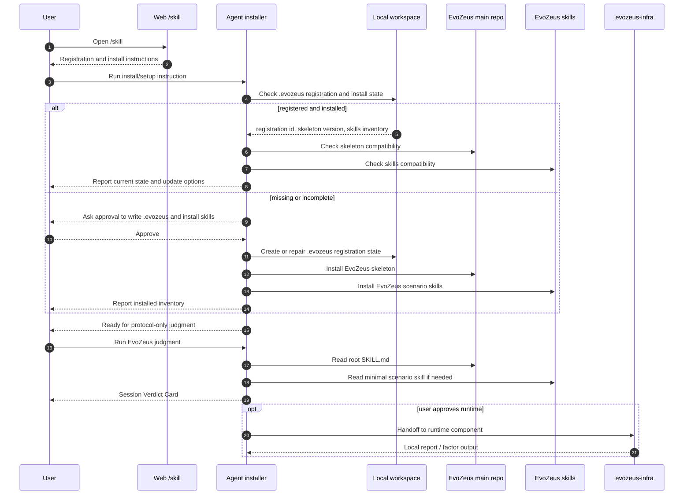

# EvoZeus Skill System Design

- Status: active support draft
- Last updated: 2026-06-20
- Scope: EvoZeus 跨 repo Skill 支撑体系、注册安装入口、场景路由和 component handoff
- Owner: MetaInFlow

本文记录 EvoZeus Skill 体系的目标设计。它承接 2026-06-18 对当前项目所有 `SKILL.md` 的 review 结论，解决三类问题：

注意：Skill 体系是 agent-readable 接入和行为固化的支撑层，不是 EvoZeus 的北极星。项目目标仍是通过社区真实案例迭代“判断高质量信号”的方法论；只有稳定、可复用且需要成为 agent instruction 的模式，才应该升级为 Skill。

1. `/skill`、root `SKILL.md`、Start Here、scenario skill 的入口语义不一致。
2. 主 repo scenario skill 和 component repo root skill 之间存在命名与职责冲突。
3. runtime、registry、reporting、doctor、contribution 等链路读得到 skill，但 precedence 不够硬。

## 1. 设计原则

| 原则 | 含义 |
| --- | --- |
| `/skill` 只做注册和安装引导 | Web `/skill` 是用户复制给 Agent 的接入说明，不直接承接 judgment、runtime scan 或 Factor execution |
| 安装必须安装两层 | 本地安装要有 EvoZeus skeleton，也要有 EvoZeus scenario skills |
| 先检查再创建 | 本地已有 `.evozeus` 时必须先检查是否已注册、是否已安装 skeleton 和 skills，再决定更新或恢复 |
| Protocol-only 仍然成立 | root `SKILL.md` 负责 zero-install judgment；runtime、scanner、runner、local state 不回到主 repo |
| Component skill 全局唯一 | 所有正式 `SKILL.md` 的 frontmatter `name` 在 cluster 内必须唯一 |
| Router 不替代 owner | `skills/index` 只选择最小必要 skill；component root skill 才是实现 owner |
| User approval before side effect | 写 `.evozeus/`、联网注册、安装 skills、运行 runtime、创建 issue/PR 前都必须获得用户确认 |

## 2. Skill 分层

```text
Web /skill
  -> registration and install guide
  -> local installer / Agent setup action
  -> .evozeus registration reconciliation
  -> install EvoZeus skeleton
  -> install EvoZeus skills
  -> ready for protocol-only judgment

EvoZeus root SKILL.md
  -> Session Verdict Card
  -> scenario routing when user asks for concrete follow-up

Scenario skills
  -> reporting / preservation / redaction / contribution / factor / registry / doctor / development

Component repo skills
  -> runtime implementation
  -> Session Signal SKILL / factor tools
```

## 3. 目标 Skill Inventory

| Layer | Skill | Owner path | Target role | Current action |
| --- | --- | --- | --- | --- |
| Public entry | Web `/skill` | `10-repos/evozeus-web/src/app/skill/skill-content.ts` | 指导注册、安装、检查 `.evozeus`、说明下一步命令 | 重写为 install-first，不再自称 scenario router |
| Install owner | `EvoZeus-Install Registration` | `10-repos/evozeus/skills/evozeus-install-registration/SKILL.md` | 定义本地注册、skeleton install、skills install、install inventory | 新增 |
| Protocol skeleton | `EvoZeus` | `10-repos/evozeus/SKILL.md` | zero-install judgment、Session Verdict Card、用户确认后路由 | 更新 `/skill` 和 install handoff |
| First-use adapter | `EvoZeus-Start Here Onboarding` | `10-repos/evozeus/skills/evozeus-start-here-onboarding/SKILL.md` | 安装完成后的第一次 protocol-only judgment | 收窄为 first-use，不再承担注册安装 |
| Router | `EvoZeus-Skill Index` | `10-repos/evozeus/skills/index/SKILL.md` | 根据用户明确意图选择 scenario skill | 增加 precedence rules |
| Runtime route | `EvoZeus-Runtime Routing` | `10-repos/evozeus/skills/evozeus-runtime-routing/SKILL.md` | 从主 repo 上下文转交 runtime trust policy | 从 `evozeus-infra` 重命名，避免冲突 |
| Infra component | `EvoZeus Infra` | `10-repos/evozeus-infra/SKILL.md` | CLI/TUI/local registry/scanner/factor execution/report execution owner | 保留 component owner，frontmatter 可改为 `evozeus-infra-component` 或保留唯一名后统一引用 |
| Session signal component | `EvoZeus Session Signal Skill` | `10-repos/evozeus-session-signal-skill/SKILL.md` | Session Signal SKILL、Python factor tools、官方 schema、canonical examples | 保留 |

命名建议：优先把主 repo scenario skill 从 `evozeus-infra` 改为 `evozeus-runtime-routing`，让 `evozeus-infra` 这个名字留给 runtime component repo。迁移期可以保留一层 deprecated alias，但正式 cluster validator 应禁止重复 `name`。

## 4. 安装和首次使用时序



## 5. 本地状态边界

安装链路允许写入最小本地状态，但不得默认创建 runtime state。

| State | Owner | Purpose | Default |
| --- | --- | --- | --- |
| `.evozeus/registration.json` | install registration skill | workspace registration status、agent identity pointer、registration id | 允许，经用户批准 |
| `.evozeus/install-manifest.json` | install registration skill | skeleton version、skills inventory、source commit、last checked time | 允许，经用户批准 |
| `.evozeus/runtime/` | runtime component | lockfile、local scans、factor outputs、reports | 禁止默认创建；runtime 批准后才创建 |
| `.evozeus/reports/` | runtime/report execution | local generated reports | 禁止默认创建；用户批准后才创建 |

Web API 可以登记 hash 和公开安全 metadata；不得接收 raw session、workspace path、token、客户资料或私有 evidence。

## 6. Precedence Rules

| 触发 | First skill | Then | 不要做 |
| --- | --- | --- | --- |
| 用户打开或复制 `/skill` | `EvoZeus-Install Registration` | 安装完成后提示是否运行 protocol-only judgment | 不直接运行 runtime 或输出 Verdict |
| 用户说“审判当前 session” | root `SKILL.md` | 必要时读 `EvoZeus-Reporting` | 不写 `.evozeus/` |
| 用户要本地 scan / factor execution / generated file report | `EvoZeus-Runtime Routing` | `evozeus-infra/SKILL.md` | 不在主 repo 实现 runtime |
| 用户要写报告正文、Verdict Card、Case summary | `EvoZeus-Reporting` | 公开前读 `EvoZeus-Redaction` | 不把 report content work 误归 runtime |
| 用户要改 registry pointer、default official set、manifest reference | `EvoZeus-Registry Release` | runtime 只消费 verified release | 不让 runtime 绕过 registry pointer |
| 用户要诊断失败、慢、卡住、环境问题 | `EvoZeus-Doctor Debugging` | 修改 runtime 实现时再读 runtime | 不把一次环境问题直接升级为 Skill |
| 用户要改 `SKILL.md` 或 `skills/` | `EvoZeus-Development` + `EvoZeus-Skill Proposal` | 使用 skill instruction PR template | 不只读 Development |
| 用户要保存或发布 judgment | `EvoZeus-Artifact Preservation` | `EvoZeus-Redaction` + route-specific skill | 不跳过用户批准 |

## 7. Official Super SKILL Repo Decision

目标设计采用 **Session Signal SKILL + factor tools**：

- `evozeus-factor-lab` 已转为 private/internal，不再作为 cluster formal skill、public contribution route 或 runtime 默认来源。
- `evozeus-session-signal-skill` 表示 Session Signal SKILL：`SKILL.md` 组合 factor tool 输出，`factors/<slug>/` 提供可解释 tools。
- runtime 不能把 private lab、official canonical examples 或测试向量当默认安装业务 Factor。
- 真实业务 Factor pack 和 scanner pack 的发布机制另行定义；在定义前不得塞进 official repo。

这会牺牲一点资产发布速度，但可以避免 official method repo 被真实执行包、scanner 权限和供应链元数据污染。

## 8. 必补 Skill 候选

| Candidate | Priority | Reason | Notes |
| --- | --- | --- | --- |
| `EvoZeus-Install Registration` | P0 | `/skill` 和 `.evozeus` install owner 缺失 | 应先做 |
| `EvoZeus-Candidate Review` | P1 | maintainer review / promotion flow 现在散在 governance docs | 用于 reviewed/core/deprecated 判定 |
| `EvoZeus-Source Locator` | P1 | evidence_refs、locator、resolver 有协议但无操作 skill | 可先作为 reporting/runtime 辅助 |
| `EvoZeus-PR Triage` | P2 | PR routing policy 有状态机但无 reviewer skill | 等 PR 量上来再做 |

不建议现在拆出独立 `evozeus-skills` repo。当前 scenario skills 仍和主 repo 的 protocol、ontology、privacy、PR routing 强耦合。

## 9. Validation Contract

Skill 体系进入下一阶段前，需要新增 cluster-level validator：

1. 扫描 `10-repos/**/SKILL.md`。
2. 排除 `node_modules` 和明确标记的 historical prototype 路径。
3. 检查 YAML frontmatter、`name`、`description`、`description` 以 `Use when` 开头。
4. 检查正式 skill `name` 全局唯一。
5. 检查 folder/name 例外是否在 manifest 中声明，例如 `skills/index` -> `evozeus-skill-index`。
6. 检查 `skill-coverage.md`、community `/skill` router 和 README 引用的 skill 是否存在。
7. 对 prototype scanner pack 和 factor examples 的 `SKILL.md` 做 exclude 或重命名，避免误发现。

通过这个 validator 前，不应声称 skill system 已闭环。
