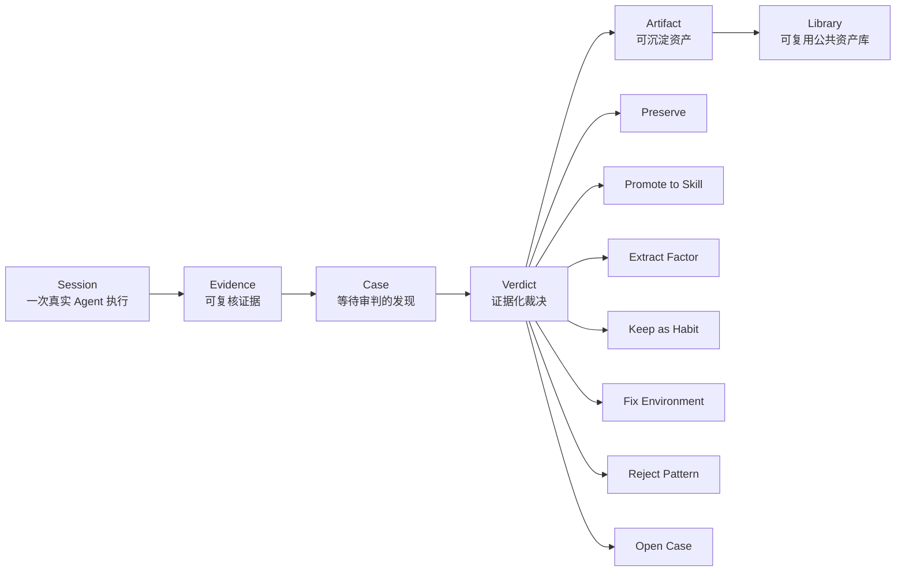
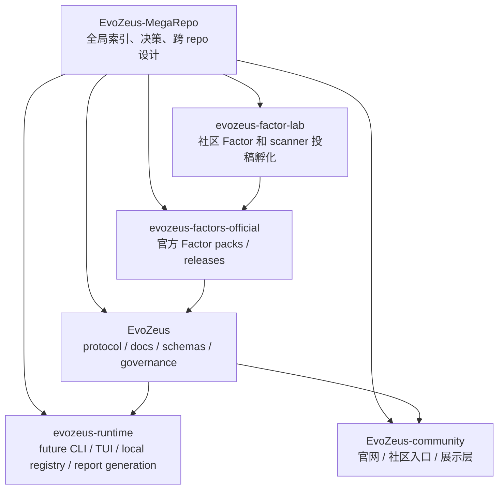
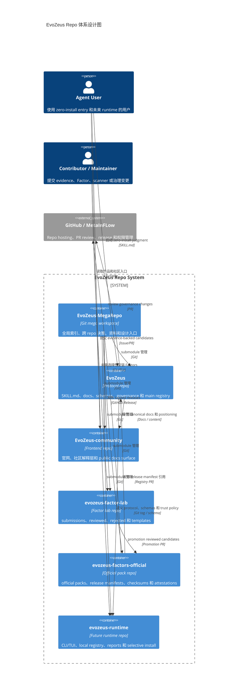

# EvoZeus 整体设计

- Status: active
- Last updated: 2026-06-18
- Scope: EvoZeus 全局产品、repo 拓扑、贡献治理、Factor registry、未来 runtime
- Owner: MetaInFlow

本文是 EvoZeus mega repo 的全局设计入口。它不替代 `10-repos/evozeus` 中的协议、schema、技能和治理细节，而是说明多个 repo 如何协同承载 EvoZeus。

## 1. One-line Definition

EvoZeus（宙斯）是 Agent Session Judgment Layer：把真实 Agent Session 放上审判台，什么该沉淀，什么该修正，什么该淘汰，由证据决定。

EvoZeus 不做 agent score，不把 Skill creation 当作唯一目标。它管理：

```text
Session -> Evidence -> Case -> Verdict -> Artifact -> Library
```

## 2. Product Boundary

EvoZeus 当前首先是 agent-readable protocol repo，不是稳定 CLI 产品。

默认承诺：

- zero-install entry：Agent 读 `SKILL.md` 即可开始。
- local-first：raw session 默认留在本地。
- evidence-backed：没有 Evidence 不形成 Verdict。
- user-approved contribution：创建 issue、PR、上传外部平台前必须得到用户确认。
- opt-in runtime packs：scanner、Factor code、MCP、LLM、可视化等运行包必须显式启用。

当前不承诺：

- 自动 raw session 上传。
- 默认扫描本地所有文件。
- 自动创建或合并 PR。
- 完整 CLI/TUI/browser companion/cloud runtime。
- 大规模 benchmark 或 agent 排名。

## 3. Core Loop



核心对象：

| Object | 含义 | 默认边界 |
| --- | --- | --- |
| Session | 一次真实 Agent 执行 | 原始材料默认本地保存 |
| Evidence | 支撑判断的最小证据 | 必须可追溯、可脱敏 |
| Case | 等待审判的 session-derived finding | 不是任意观点 |
| Verdict | 对 Case 或 Candidate 的裁决 | 必须绑定证据和下一步动作 |
| Artifact | Verdict 落成的资产 | Skill、Factor、Habit、Environment Rule、Accepted Case、Rejected Pattern |
| Library | 被接受的可复用公共资产库 | 需要索引、生命周期、淘汰路径 |

## 4. Global Repo Topology



### 4.1 EvoZeus Repo 体系设计图



Repo 职责：

| Repo | 职责 | 当前状态 |
| --- | --- | --- |
| `EvoZeus-MegaRepo` | 全局工作区、跨 repo 决策、资料索引、repo 拓扑 | active / remote 已创建 |
| `EvoZeus` | 核心 protocol、`SKILL.md`、docs、schemas、governance gates | active |
| `EvoZeus-community` | 官网、社区解释层、未来 public docs surface | active / 已接入 |
| `evozeus-factor-lab` | 社区 Factor / scanner module 投稿、reviewed/rejected 记录 | active shell / 已接入 |
| `evozeus-factors-official` | maintainer-promoted official Factor packs、GitHub Releases | active shell / 已接入 |
| `evozeus-runtime` | 未来 CLI/TUI/browser companion/local registry | active shell / 已接入，产品能力仍为 future |

## 5. User Paths

### 5.1 Judge One Session

```text
User copies entry prompt
-> Agent reads SKILL.md
-> Collects local evidence
-> Outputs Session Verdict Card
-> User decides whether to preserve or contribute
```

原则：

- 第一次使用不安装依赖。
- 不上传 raw session。
- 先输出 Verdict Card，不默认写文件或发 GitHub。

### 5.2 Contribute a Case or Candidate

```text
Local Evidence Report
-> redaction
-> Candidate / Case draft
-> user approval
-> issue or PR
-> dry-run governance gates
-> maintainer review
```

社区贡献优先是 evidence contribution，不是随意改 runtime、workflow 或 agent instructions。

### 5.3 Install Selected Factors

```text
main registry
-> release manifest
-> select factor / bundle / pack
-> checksum verification
-> local lockfile
-> runtime executes by declared permissions
```

用户应该能只安装少数 Factors，而不是 clone 全量 Factor library。

## 6. Factor Registry Design

Factor 生态采用 manifest-driven selective install。

主规则：

```text
lab merge != official release != main registry publication
```

分层：

| Layer | 负责什么 | 默认信任 |
| --- | --- | --- |
| Main registry | 收录已审核 release manifest 引用 | stable only |
| Factor lab repo | 社区投稿、自动门禁、reviewed/rejected 记录 | explicit install only |
| Official pack repo | official packs、release assets、checksums、SBOM、attestation | registry approved |
| Third-party pack | 社区自托管 pack | community opt-in |

主 registry 不抓 lab repo 的 moving branch。它只接受：

- allowlisted repo
- Git tag 或 commit SHA
- release manifest
- checksum
- channel
- review state
- optional artifact attestation

## 7. Community Upload to Launch Flow

```mermaid
flowchart LR
  A["Contributor"] --> B["Issue / Discussion<br/>problem, evidence, scenario"]
  B --> C["PR to factor lab<br/>submissions/author/factor-id"]
  C --> D["Automated gates<br/>schema / privacy / secret / license"]
  D --> E{"Contains scanner code?"}

  E -- "No" --> F["Factor Review<br/>semantics, evidence, reuse"]
  E -- "Yes" --> G["Security CI<br/>lockfile, static analysis, sandbox, determinism"]
  G --> H["Security Review<br/>permissions, deps, outputs"]

  F --> I{"Approved?"}
  H --> I

  I -- "No" --> J["Rejected Record<br/>negative pattern or revision request"]
  I -- "Yes" --> K["Reviewed Candidate<br/>explicit install only"]

  K --> L["Promotion PR<br/>official Factor pack repo"]
  L --> M["Official CI<br/>manifest, hashes, compatibility"]
  M --> N["CODEOWNERS + Maintainer Approval"]
  N --> O["GitHub Release<br/>index, checksums, SBOM, attestation"]
  O --> P["Registry PR<br/>EvoZeus main registry"]
  P --> Q["Registry Published<br/>stable channel"]
  Q --> R["User selective install<br/>lockfile"]
```



`factor.yaml` 和 scanner module 分开治理：

- `factor.yaml` 重点审核语义、证据、触发条件、反例和隐私。
- scanner module 是可执行插件，必须审核权限、依赖、沙箱、确定性和供应链。

## 8. Governance Defaults

EvoZeus 的治理原则：

- One PR, one primary layer, one review target.
- High-risk paths require owner / maintainer review.
- GitHub automation dry-run by default：label、comment、status 可以，approve、merge、promote、auto-close 不可以。
- Public artifact 必须脱敏，不依赖 raw private session 才能理解。
- Rejected contribution 也有价值，应沉淀为 negative pattern 或 rejected record。

高风险面：

- `SKILL.md`
- `skills/`
- `.github/workflows/`
- `schemas/`
- `docs/reference/ontology.md`
- `docs/reference/evidence-grading.md`
- privacy / redaction rules
- future `factors/registry/`
- official Factor pack manifests
- scanner modules
- runtime upload / extraction code

## 9. Roadmap

### Now

- 保持 `EvoZeus` 主仓库小而清晰。
- 合并 Factor registry ADR 和 governance。
- 在 mega repo 维护跨 repo 拓扑和决策记录。
- 所有核心 repo 已建仓并作为 submodule 接入 mega repo。
- 暂不公开开放 lab repo 投稿。

### Next

- 在主仓库补最小 schema：
  - `factor.schema.json`
  - `factor-pack.schema.json`
  - `scanner-manifest.schema.json`
- 补主 registry 示例：
  - `factors/registry/index.example.json`
- 补 registry / manifest 校验脚本。
- 设计 lab repo PR template 和 CI gate。

### Then

- 启用 `evozeus-factor-lab` 投稿流程。
- 接收少量内部/邀请制 Factor 投稿。
- 形成 reviewed/rejected 记录。
- 有 1-3 个 reviewed candidates 后启用 `evozeus-factors-official` release 流程。

### Later

- 实现 local runtime：
  - `.evozeus/` local registry
  - Markdown/JSON report
  - selective Factor install
  - scanner sandbox
  - lockfile
- 再评估 CLI/TUI/browser companion/cloud 是否拆 repo。

## 10. Open Decisions

| Decision | Current bias | Blocker |
| --- | --- | --- |
| lab repo 是否立即公开投稿 | 先 private 或邀请制 | schema、template、CI gate 未补齐 |
| official Factor pack repo 何时启用 release 流程 | 有 reviewed candidates 后启用 | 需要真实候选资产 |
| runtime 何时从 shell repo 进入正式开发 | 暂不实现稳定 runtime | CLI/TUI 边界未稳定 |
| Factor pack 是否支持第三方 registry | 支持，但默认不显示 | installer 和 trust policy 未实现 |
| scanner 是否允许联网 | 默认不允许 | 需要明确权限模型和安全 review |

## 11. Source Links

当前本地来源：

- `10-repos/evozeus/SKILL.md`
- `10-repos/evozeus/docs/design/active/design_doc-v0.1-agent-session-judgment-layer.md`
- `10-repos/evozeus/docs/decisions/ADR-0001-static-skill-entry-and-zero-install.md`

待主 repo 分支合并后同步的来源：

- `docs/decisions/ADR-0002-factor-pack-registry-and-community-promotion.md`
- `docs/governance/factor-registry-governance.md`
