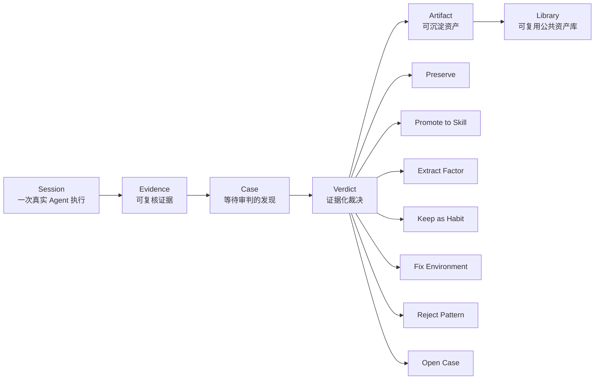
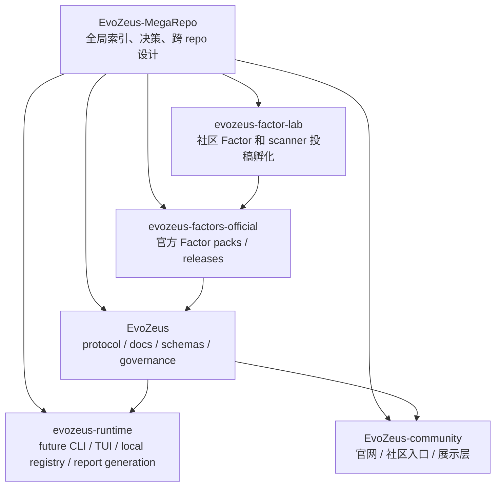
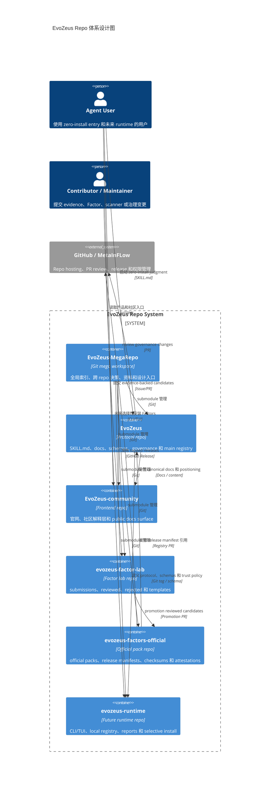
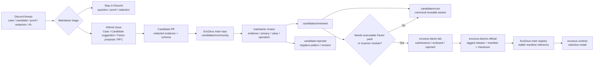
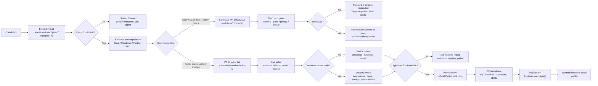

# EvoZeus 整体设计

- Status: active
- Last updated: 2026-06-18
- Scope: EvoZeus 全局产品、repo 拓扑、贡献治理、Factor registry、未来 runtime
- Owner: MetaInFlow

本文是 EvoZeus mega repo 的全局设计入口。它不替代 `10-repos/evozeus` 中的协议、schema、技能和治理细节，而是说明多个 repo 如何协同承载 EvoZeus。

## 1. One-line Definition

EvoZeus（宙斯）是 Agent Session Judgment Layer：把真实 Agent Session 放上审判台，什么该沉淀，什么该修正，什么该淘汰，由证据决定。

EvoZeus 不做 agent score，不把 Skill creation 当作唯一目标。它管理：

```text
Session -> Evidence -> Case -> Verdict -> Artifact -> Library
```

## 2. Product Boundary

EvoZeus 当前首先是 agent-readable protocol repo，不是稳定 CLI 产品。

默认承诺：

- zero-install entry：Agent 读 `SKILL.md` 即可开始。
- local-first：raw session 默认留在本地。
- evidence-backed：没有 Evidence 不形成 Verdict。
- user-approved contribution：创建 issue、PR、上传外部平台前必须得到用户确认。
- opt-in runtime packs：scanner、Factor code、MCP、LLM、可视化等运行包必须显式启用。

当前不承诺：

- 自动 raw session 上传。
- 默认扫描本地所有文件。
- 自动创建或合并 PR。
- 完整 CLI/TUI/browser companion/cloud runtime。
- 大规模 benchmark 或 agent 排名。

## 3. Core Loop



核心对象：

| Object | 含义 | 默认边界 |
| --- | --- | --- |
| Session | 一次真实 Agent 执行 | 原始材料默认本地保存 |
| Evidence | 支撑判断的最小证据 | 必须可追溯、可脱敏 |
| Case | 等待审判的 session-derived finding | 不是任意观点 |
| Verdict | 对 Case 或 Candidate 的裁决 | 必须绑定证据和下一步动作 |
| Artifact | Verdict 落成的资产 | Skill、Factor、Habit、Environment Rule、Accepted Case、Rejected Pattern |
| Library | 被接受的可复用公共资产库 | 需要索引、生命周期、淘汰路径 |

## 4. Global Repo Topology



### 4.1 EvoZeus Repo 体系设计图



Repo 职责：

| Repo | 职责 | 当前状态 |
| --- | --- | --- |
| `EvoZeus-MegaRepo` | 全局工作区、跨 repo 决策、资料索引、repo 拓扑 | active / remote 已创建 |
| `EvoZeus` | 核心 protocol、`SKILL.md`、docs、schemas、governance gates | active |
| `EvoZeus-community` | 官网、社区解释层、未来 public docs surface | active / 已接入 |
| `evozeus-factor-lab` | 社区 Factor / scanner module 投稿、reviewed/rejected 记录 | active shell / 已接入 |
| `evozeus-factors-official` | maintainer-promoted official Factor packs、GitHub Releases | active shell / 已接入 |
| `evozeus-runtime` | 未来 CLI/TUI/browser companion/local registry | active shell / 已接入，产品能力仍为 future |

### 4.2 社区共创机制

EvoZeus 的社区共创不是先给社区 repo write 权限，而是把真实 session 观察逐层变成可审查资产。

当前机制已经在 `EvoZeus` 主 repo 内成型：

- `CONTRIBUTING.md`：贡献以 Case 为中心，必须有 evidence、privacy note 和 proposed verdict。
- Issue templates：`case`、`candidate_suggestion`、`factor`、`governance_rfc` 分开收口。
- PR templates：Candidate、code、schema、skill instruction、governance、docs/example 分开审查。
- Candidate lifecycle：`community -> reviewed -> core -> deprecated`。
- PR routing：`review / needs-info / needs-redaction / convert-to-rfc / owner-only / close`。
- Automation：dry-run label/comment/status only，不 approve、不 merge、不 promotion。
- Discord / OpenClaw 融入方案：Discord 是 PR 前缓冲层，不替代 GitHub 治理。

共创漏斗：



关键边界：

- Discord 只做讨论、证据补齐、脱敏帮助和 PR 前分流。
- `EvoZeus` public 主 repo 是正式社区入口和 canonical governance surface。
- 普通 Case、Candidate、Pattern、docs/example 贡献不需要进入 `evozeus-factor-lab`。
- `evozeus-factor-lab` 只承接更重的孵化对象：Factor pack、scanner module、需要 reviewed/rejected 记录的实验性资产。
- `evozeus-factors-official` 只承接 maintainer-promoted official pack release。
- `evozeus-runtime` 只消费 registry 和 release manifest，不直接消费 Discord thread 或 lab moving branch。
- raw private session、客户资料、secret、内部路径、未脱敏日志不进入任何 public repo。

### 4.3 Repo 可见性和权限模型

设计原则：

- public 面优先承载共创入口、审查材料和可被用户信任的资产。
- private 面只承载内部协调、未脱敏材料、未发布战略、部署 secret 或安全敏感开发。
- 权限授予围绕“分流、评审、合并、发布”四种动作拆开，不把社区共创误解成 repo write 权限。
- visibility change 只能由 `evozeus-owners` 执行，并必须写入 `decision-log.md`。

当前组织事实：

- MetaInFlow 组织当前已有团队：`0812team`，权限语义为 `pull/read`。
- `0812team` 只能作为内部只读团队使用，不承载 Admin、Maintain、Write 权限。
- 高权限需要新增专门的 EvoZeus teams，避免把其它项目的默认团队权限混进 EvoZeus 治理。

目标团队：

| Team | GitHub 权限定位 | 成员范围 | 用途 |
| --- | --- | --- | --- |
| `evozeus-owners` | Admin | 组织 owner、EvoZeus DRI | repo settings、visibility、secrets、branch protection、release override |
| `evozeus-maintainers` | Maintain | 核心 maintainer | 日常治理、label、branch policy、release 协调，不默认管理 org-level secrets |
| `evozeus-triagers` | Triage | Discord / issue 分流者 | issue 分类、label、needs-proof、needs-redaction、route-to-rfc，不 merge |
| `evozeus-protocol-maintainers` | Write / CODEOWNERS review | protocol / schema / governance 负责人 | `EvoZeus` 主 repo 的协议、docs、schema、registry review |
| `evozeus-community-maintainers` | Write | 官网和内容维护者 | `EvoZeus-community` 的页面、内容、部署变更 |
| `evozeus-factor-maintainers` | Write / CODEOWNERS review | Factor reviewer | `EvoZeus` candidate review、`evozeus-factor-lab` submissions/reviewed/rejected 维护 |
| `evozeus-security-reviewers` | Maintain 或 required reviewer | 安全、供应链、runtime reviewer | scanner module、official pack、runtime 权限、上传和联网链路 review |
| `evozeus-runtime-maintainers` | Write | runtime 负责人 | future CLI/TUI/local registry/report 代码维护 |
| `metainflow-internal-read` 或 `0812team` | Read | 内部观察者、协作者 | private repo 只读访问，不参与 merge 或 settings |

每个 repo 的目标可见性：

| Repo | 当前可见性 | 目标可见性 | 共创角色 | Public gate |
| --- | --- | --- | --- | --- |
| `EvoZeus-MegaRepo` | private | private | 内部协调层，不是社区入口 | 不公开；对外只摘录成熟决策到 public docs |
| `EvoZeus` | public | public | 正式社区入口、Case/Candidate/Factor/RFC intake、canonical governance | 已 public；持续执行 privacy、proof、schema、CODEOWNERS gates |
| `EvoZeus-community` | private | 尽快 public-read，launch 前不必开放写权限 | 官网、Discord 入口、贡献路线说明、public docs surface | 无 secret、部署配置隔离、基础内容定稿、链接到主 repo issue/PR 路线 |
| `evozeus-factor-lab` | private | 模板和门禁补齐后 public-read / PR-gated | Factor pack、scanner module、实验性 reviewed/rejected 孵化，不是普通 Case 入口 | `README` 明确不直接安装；submission template、redaction rule、scanner permission policy、secret/license scan |
| `evozeus-factors-official` | private | 首个 official pack release 前 public-read | official pack 发布源，用户必须能审计 release assets | reviewed candidate、tagged release flow、manifest、checksum、SBOM/attestation、registry PR 流程 |
| `evozeus-runtime` | private | trust policy 和权限模型稳定后 public-read | 可执行 runtime，最终必须可审计；早期 private 避免未稳 API 被误用 | permission model、upload-off-by-default、scanner sandbox、lockfile、dependency audit |

每个 repo 的权限分配：

| Repo | Admin | Maintain | Write | Triage / Read | 特殊规则 |
| --- | --- | --- | --- | --- | --- |
| `EvoZeus-MegaRepo` | `evozeus-owners` | `evozeus-maintainers` | 不默认开放 | `metainflow-internal-read` / `0812team` read | 不存 raw private session；submodule 指针变化必须说明影响 |
| `EvoZeus` | `evozeus-owners` | `evozeus-maintainers` | `evozeus-protocol-maintainers` + `evozeus-factor-maintainers` | public read；`evozeus-triagers` triage；外部贡献走 issue/fork PR | 这是社区共创主入口；高风险路径需 CODEOWNERS；triager 不 merge |
| `EvoZeus-community` | `evozeus-owners` | `evozeus-maintainers` | `evozeus-community-maintainers` | public 后 public read；internal phase 由 `0812team` read | 只指向贡献路线，不收 raw evidence；部署 secrets 只在 GitHub Environments / Vercel 管理 |
| `evozeus-factor-lab` | `evozeus-owners` | `evozeus-maintainers` | `evozeus-factor-maintainers` | public 后 public read/PR；`evozeus-triagers` triage | lab merge 不等于 official release；scanner code 必须 security review |
| `evozeus-factors-official` | `evozeus-owners` | `evozeus-maintainers` + `evozeus-security-reviewers` | 少量 release operator | public 后 public read | 只接 promotion PR；tag、manifest、checksum、SBOM 必须一致 |
| `evozeus-runtime` | `evozeus-owners` | `evozeus-maintainers` + `evozeus-security-reviewers` | `evozeus-runtime-maintainers` | public 后 public read；internal phase 由 `0812team` read | 扫描、上传、联网、插件执行必须 security review |

Branch protection baseline：

| Repo 类型 | Required reviews | Required checks | 其它保护 |
| --- | --- | --- | --- |
| mega repo | 1 maintainer review | markdown / link check 可后补 | 禁止 force push；submodule pointer 变化必须在 PR 描述中说明 |
| public intake / protocol repo | 2 reviews；高风险路径必须 CODEOWNERS | schema validate、proof gate、privacy scan、dirty PR check、queue guard、secret scan | 禁止 direct push to main；require conversation resolution；first-time contributor approval |
| community frontend | 1 review；launch 内容需 owner review | build、test、lint、secret scan | preview deployment 必须与 PR 绑定；内容变更不得绕过主 repo governance |
| factor lab | 1 factor review；scanner code 追加 1 security review | schema、privacy、secret、license、scanner static checks | public-read does not mean install source；投稿默认不能进入 official 或 registry |
| official packs | 2 reviews；至少 1 security reviewer | manifest validate、checksum verify、SBOM/attestation check | release 必须绑定 tag；禁止从 moving branch 发布 |
| runtime | 2 reviews；权限/上传/扫描路径必须 security review | build、test、sandbox tests、secret scan、dependency audit | 默认 local-first；上传和联网必须 opt-in |

权限授予流程：

1. 先判断动作类型：分流、评审、合并、发布、settings 管理。
2. 优先加 team，不直接给个人 repo 权限；临时协作必须有到期时间。
3. 外部共创默认通过 Discord thread、GitHub issue、fork PR，不授予 repo write。
4. Triage 权限可以给社区维护者；Write 只给需要维护文件的人；Maintain/Admin 只给 release/settings 责任人。
5. Admin 只给 `evozeus-owners`；任何 visibility、secret、branch protection 变更都需要 owner 确认。
6. 每月审计 Write 及以上权限；每次人员离开项目时立即移除 team，并轮换相关 secrets。

建议执行顺序：

1. 新建 `evozeus-owners`、`evozeus-maintainers`、`evozeus-triagers`、`evozeus-protocol-maintainers`、`evozeus-community-maintainers`、`evozeus-factor-maintainers`、`evozeus-security-reviewers`、`evozeus-runtime-maintainers`。
2. 保留 `0812team` 为 read-only，不授予 Write 及以上权限。
3. 先把 `EvoZeus-community` 调整为 public-read，作为官网和贡献路线入口。
4. 补齐 `evozeus-factor-lab` 的 template、redaction rule、scanner permission policy 后，调整为 public-read / PR-gated。
5. 有第一个 reviewed Factor pack 后，把 `evozeus-factors-official` 调整为 public-read，并发布 tag + manifest + checksum + SBOM。
6. `evozeus-runtime` 等 trust policy 和 permission model 稳定后再 public-read。

## 5. User Paths

### 5.1 Judge One Session

```text
User copies entry prompt
-> Agent reads SKILL.md
-> Collects local evidence
-> Outputs Session Verdict Card
-> User decides whether to preserve or contribute
```

原则：

- 第一次使用不安装依赖。
- 不上传 raw session。
- 先输出 Verdict Card，不默认写文件或发 GitHub。

### 5.2 Contribute a Case or Candidate

```text
Local Evidence Report
-> redaction
-> Candidate / Case draft
-> user approval
-> issue or PR
-> dry-run governance gates
-> maintainer review
```

社区贡献优先是 evidence contribution，不是随意改 runtime、workflow 或 agent instructions。

### 5.3 Install Selected Factors

```text
main registry
-> release manifest
-> select factor / bundle / pack
-> checksum verification
-> local lockfile
-> runtime executes by declared permissions
```

用户应该能只安装少数 Factors，而不是 clone 全量 Factor library。

## 6. Factor Registry Design

Factor 生态采用 manifest-driven selective install。

主规则：

```text
lab merge != official release != main registry publication
```

分层：

| Layer | 负责什么 | 默认信任 |
| --- | --- | --- |
| Main registry | 收录已审核 release manifest 引用 | stable only |
| Factor lab repo | Factor pack / scanner module 孵化、自动门禁、reviewed/rejected 记录 | explicit install only |
| Official pack repo | official packs、release assets、checksums、SBOM、attestation | registry approved |
| Third-party pack | 社区自托管 pack | community opt-in |

主 registry 不抓 lab repo 的 moving branch。它只接受：

- allowlisted repo
- Git tag 或 commit SHA
- release manifest
- checksum
- channel
- review state
- optional artifact attestation

## 7. Community Upload to Launch Flow



`factor.yaml` 和 scanner module 分开治理：

- `factor.yaml` 重点审核语义、证据、触发条件、反例和隐私。
- scanner module 是可执行插件，必须审核权限、依赖、沙箱、确定性和供应链。

## 8. Governance Defaults

EvoZeus 的治理原则：

- One PR, one primary layer, one review target.
- High-risk paths require owner / maintainer review.
- GitHub automation dry-run by default：label、comment、status 可以，approve、merge、promote、auto-close 不可以。
- Public artifact 必须脱敏，不依赖 raw private session 才能理解。
- Rejected contribution 也有价值，应沉淀为 negative pattern 或 rejected record。

高风险面：

- `SKILL.md`
- `skills/`
- `.github/workflows/`
- `schemas/`
- `docs/reference/ontology.md`
- `docs/reference/evidence-grading.md`
- privacy / redaction rules
- future `factors/registry/`
- official Factor pack manifests
- scanner modules
- runtime upload / extraction code

## 9. Roadmap

### Now

- 保持 `EvoZeus` 主仓库小而清晰。
- 明确 `EvoZeus` public 主 repo 是社区共创正式入口。
- 使用 Discord 作为 PR 前缓冲层：route、proof、redaction、RFC 分流。
- 合并 Factor registry ADR 和 governance。
- 在 mega repo 维护跨 repo 拓扑和决策记录。
- 所有核心 repo 已建仓并作为 submodule 接入 mega repo。

### Next

- 将 `EvoZeus-community` 调整为 public-read，作为官网和贡献路线入口。
- 在主仓库补最小 schema：
  - `factor.schema.json`
  - `factor-pack.schema.json`
  - `scanner-manifest.schema.json`
- 补主 registry 示例：
  - `factors/registry/index.example.json`
- 补 registry / manifest 校验脚本。
- 设计 `evozeus-factor-lab` PR template、redaction rule、scanner permission policy 和 CI gate。

### Then

- 将 `evozeus-factor-lab` 调整为 public-read / PR-gated。
- 接收少量 Factor pack / scanner module 投稿。
- 形成 lab reviewed/rejected 记录。
- 有 1-3 个 reviewed candidates 后启用 `evozeus-factors-official` release 流程。

### Later

- 实现 local runtime：
  - `.evozeus/` local registry
  - Markdown/JSON report
  - selective Factor install
  - scanner sandbox
  - lockfile
- 再评估 CLI/TUI/browser companion/cloud 是否拆 repo。

## 10. Open Decisions

| Decision | Current bias | Blocker |
| --- | --- | --- |
| `EvoZeus-community` 是否先公开 | 尽快 public-read | secret、部署配置和贡献入口链接需确认 |
| `evozeus-factor-lab` 何时公开 | 模板和 scanner 门禁补齐后 public-read / PR-gated | schema、template、CI gate、scanner permission policy 未补齐 |
| official Factor pack repo 何时启用 release 流程 | 有 reviewed candidates 后启用 | 需要真实候选资产 |
| runtime 何时从 shell repo 进入正式开发 | 暂不实现稳定 runtime | CLI/TUI 边界未稳定 |
| Factor pack 是否支持第三方 registry | 支持，但默认不显示 | installer 和 trust policy 未实现 |
| scanner 是否允许联网 | 默认不允许 | 需要明确权限模型和安全 review |

## 11. Source Links

当前本地来源：

- `30-ops/discord-openclaw-governance-plan.md`
- `10-repos/evozeus/SKILL.md`
- `10-repos/evozeus/docs/design/active/design_doc-v0.1-agent-session-judgment-layer.md`
- `10-repos/evozeus/docs/decisions/ADR-0001-static-skill-entry-and-zero-install.md`

待主 repo 分支合并后同步的来源：

- `docs/decisions/ADR-0002-factor-pack-registry-and-community-promotion.md`
- `docs/governance/factor-registry-governance.md`
