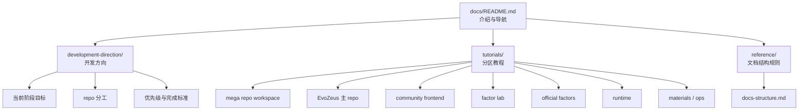

# EvoZeus Mega Repo Docs

- Status: active
- Last updated: 2026-06-18
- Scope: EvoZeus mega repo 的人类可读入口、开发方向和 tutorial 导航
- Owner: MetaInFlow

本文是 `EvoZeus-MegaRepo` 的介绍文档。它回答三个问题：

1. 这个 mega repo 是什么。
2. EvoZeus 接下来应该往哪里开发。
3. 每个 repo、资料区和运营区应该怎么开始使用。

`docs/` 是面向人的阅读层；`00-global/` 是跨 repo 决策、索引和架构底账。阅读、协作、onboarding 先看 `docs/`；需要查正式决策、repo index、权限模型时再进入 `00-global/`。

## 1. Mega Repo 是什么

`EvoZeus-MegaRepo` 是 EvoZeus 全局工作区。它不替代各个业务 repo，而是把这些 repo、资料、方向、教程、权限设计和跨 repo 决策放在一个可以统一维护的地方。

当前承载：

| 区域 | 用途 |
| --- | --- |
| `00-global/` | 全局设计、repo index、material index、decision log、命名和目录规则 |
| `10-repos/` | EvoZeus 相关 repo 的 submodule 工作区 |
| `20-materials/` | 外部资料、调研、会议纪要、Feishu 导出和素材 |
| `30-ops/` | 社区运营、权限执行、发布操作、迁移和排障记录 |
| `90-archive/` | 冻结上下文、历史版本和过期资料 |
| `docs/` | 开发方向、教程和文档维护规则 |

## 2. 文档主线

`docs/` 只承担两条主线：

| 主线 | 目录 | 目标 |
| --- | --- | --- |
| 定义开发方向 | `development-direction/` | 说明 EvoZeus 当前阶段的开发重点、优先级、repo 分工和完成标准 |
| Tutorial 介绍 | `tutorials/` | 让新人或 Agent 能按部分理解每个 repo / 工作区怎么用、产出什么、不要做什么 |

辅助目录：

| 目录 | 作用 |
| --- | --- |
| `reference/` | 维护文档结构、命名规则和文档责任边界 |

## 3. 先读什么

如果你是第一次进入：

1. 读本文，确认 mega repo 边界。
2. 读 [Development Direction](development-direction/README.md)，理解当前开发方向。
3. 按任务进入 [Tutorials](tutorials/README.md)。
4. 需要查正式决策时，再读 `../00-global/decision-log.md` 和 `../00-global/evozeus-overall-design.md`。

## 4. Docs Map

## 5. 维护规则

- 项目产出文件默认使用中文；关键专有名词、专业名词可以保留英文。
- 新增教程时，先判断它属于 `development-direction` 还是 `tutorials`，不要把临时会议纪要塞进 docs。
- `docs/` 写给人和 Agent 读；`00-global/` 记录正式全局事实。
- 涉及 repo 可见性、权限、发布、拆 repo、主方向变化时，必须同步更新 `00-global/decision-log.md`。
- Feishu 相关操作统一使用 `larkcli`。
